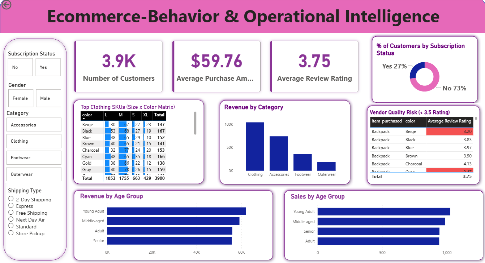

# E-Commerce Customer Behavior & Inventory Intelligence Analytics



## Executive Summary
This project delivers an end-to-end data analytics solution evaluating **3,900 e-commerce transaction records** to bridge the gap between customer purchasing trends and operational supply chain decisions. Using **Python (Pandas)** for automated data pipeline processing, **T-SQL (MS SQL Server)** for advanced business logic, and **Power BI** for visual reporting, this project identifies high-margin customer segments, flags vendor quality risks, and optimizes warehouse SKU management.

---

## Technical Stack & Tools
* **Database & Querying:** T-SQL / MS SQL Server (CTEs, Window Functions, Conditional Aggregation, Partitioning)
* **Data Processing & ETL:** Python (Pandas, NumPy, SQLAlchemy)
* **Business Intelligence:** Power BI (DAX Measures, Data Modeling, Heatmaps, Conditional Formatting)
* **Version Control:** Git & GitHub

---

## Business Problems & Key Analytical Findings

* **1. Vendor Quality & Defect Auditing**
  * **Insight:** Identified specific product-color variants consistently receiving review ratings below **3.5 / 5.0 stars**. 
  * **Impact:** Flags low-performing SKUs for operational vendor audits to reduce return rates and improve overall product satisfaction.

* **2. Size-Color Matrix for Warehouse Stock Control**
  * **Insight:** Isolated the top 5 size-and-color combinations within the high-revenue *Clothing* category.
  * **Impact:** Prevents stockouts of high-demand variants (e.g., Medium/Large in core colors) and minimizes excess inventory costs.

* **3. Customer Segmentation & Loyalty Drivers**
  * **Insight:** Segmented customers into *New*, *Returning*, and *Loyal* tiers. Repeat buyers (>5 previous purchases) demonstrated distinct subscription adoption behaviors.
  * **Impact:** Enables marketing teams to deploy targeted retention campaigns rather than relying on blanket discount strategies.

---

## Data Pipeline & Repository Architecture

```text
ecommerce-behavior-operations-analytics/
│
├── sql/
│   └── customer_behavior_analysis.sql   # Production T-SQL queries & analytics scripts
│
├── powerbi/
│   ├── customer_behavior_dashboard.pbix # Interactive Power BI workbook
│   └── dashboard_preview.png            # Visual preview for documentation
│
├── data/
│   └── customer_shopping_behavior.csv   # Raw dataset
│
├── notebooks/
│   └── Customer_Shopping_Behavior_Analysis.ipynb # Python data cleaning & SQL workflow
│
├── LICENSE
└── README.md
```


## Key T-SQL Query Examples

### Vendor Quality Risk Identification
```sql
SELECT 
    item_purchased,
    color,
    AVG(review_rating) AS avg_rating,
    COUNT(*) AS total_sold
FROM dbo.customer
GROUP BY item_purchased, color
HAVING AVG(review_rating) < 3.5
ORDER BY avg_rating ASC;

### Size-Color Inventory Matrix (Clothing Category)
```sql
SELECT TOP 5 
    size, 
    color, 
    COUNT(*) AS total_purchased
FROM dbo.customer
WHERE category = 'Clothing'
GROUP BY color, size
ORDER BY total_purchased DESC;

## Interactive Dashboard Features
* **Vendor Quality Risk Panel:** Table visualization with conditional formatting highlighting items rated below 3.5 stars.
* **Top Clothing SKUs Heatmap:** Matrix grid evaluating `Size` x `Color` sales volume for inventory planning.
* **Executive Overview:** High-level KPI cards tracking total revenue, average spend ($59.76), and average rating (3.75).

---

## Setup & How to Run

1. **Clone the repository:**
   ```bash
   git clone [https://github.com/harshitajawaharmalani/ecommerce-behavior-operations-analytics.git](https://github.com/harshitajawaharmalani/ecommerce-behavior-operations-analytics.git)

Power BI Dashboard: Open powerbi/customer_behavior_dashboard.pbix in Power BI Desktop and update your local SQL Server data source connection.